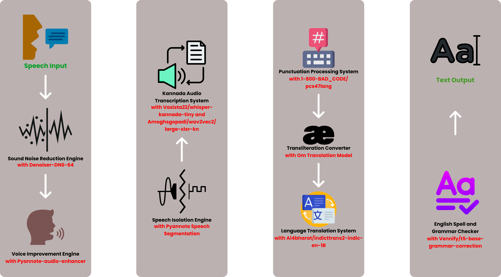
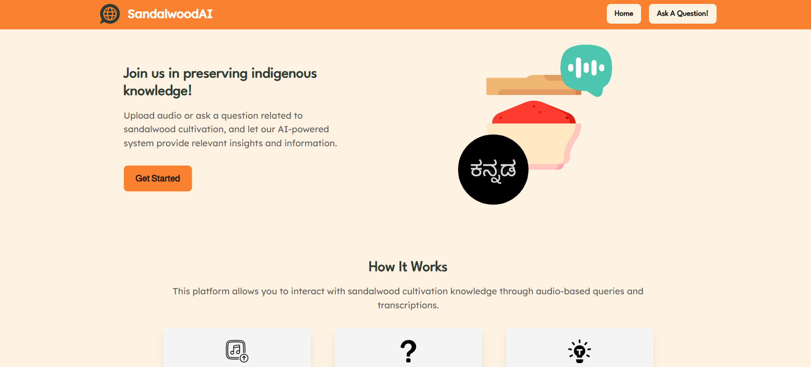
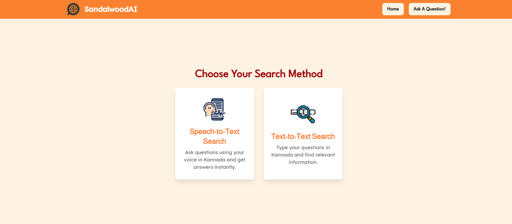
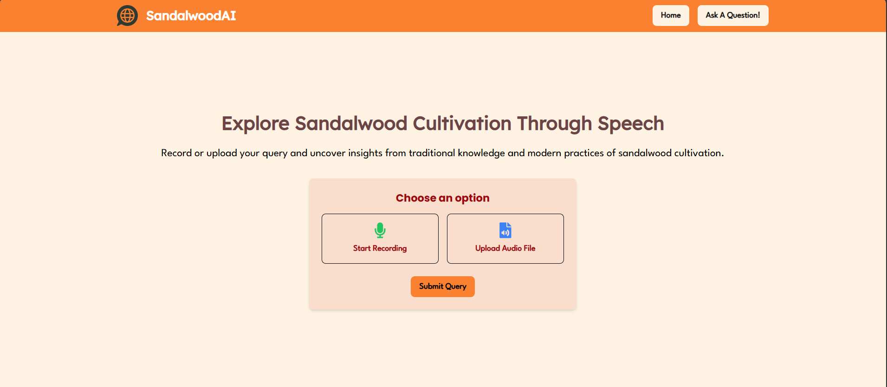
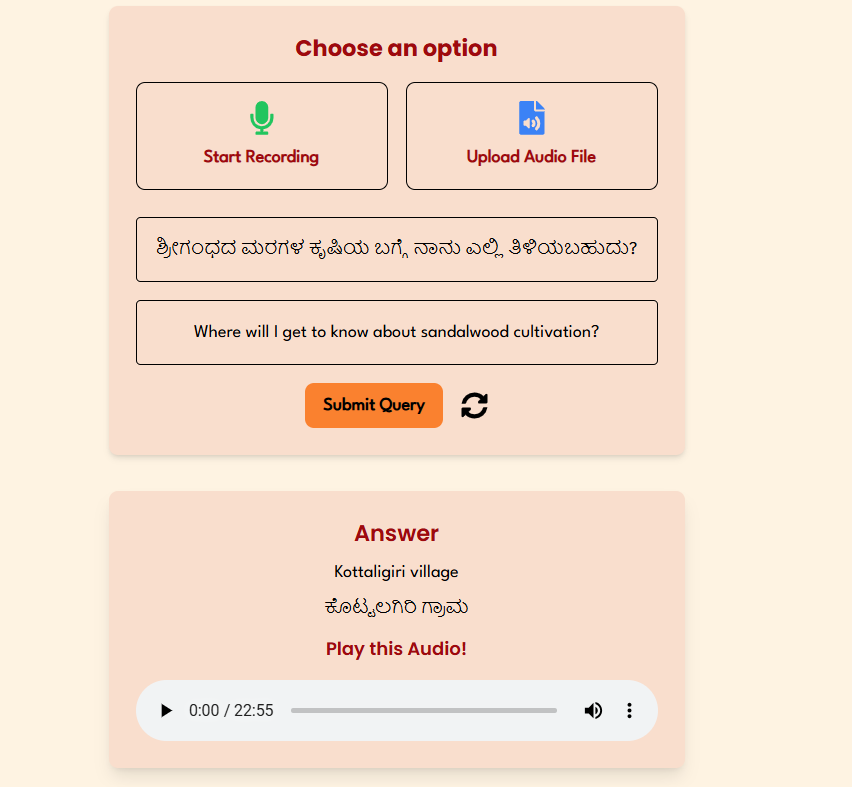
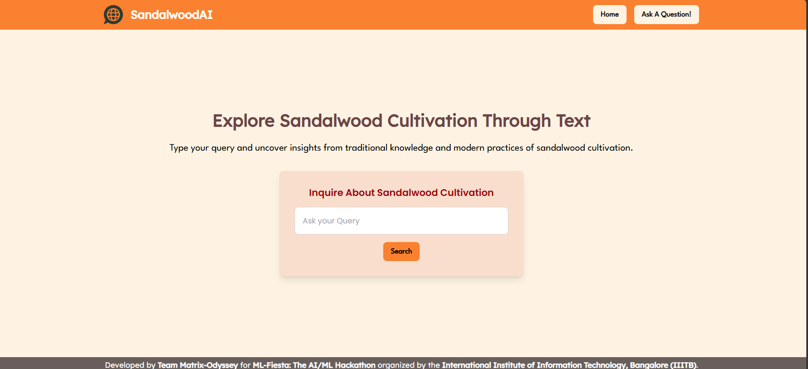
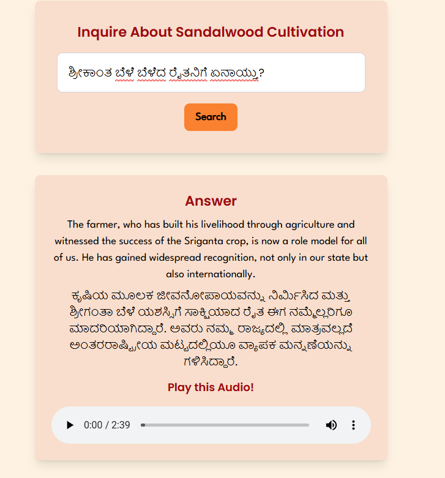

# SandalwoodAI - An AI-Powered Platform for Kannada-Based ASR and Knowledge Querying 

## **Team Information**
1. [**Rohith Ganesh Kanchi**](https://github.com/rZk1809) - Team Leader & Machine Learning Engineer
2. [**Jayashre**](https://www.linkedin.com/in/jayashrek/) - Full Stack Developer
3. [**Giridharen G**](https://github.com/dg-giridharen) - Machine Learning Engineer

## Demo Link -> [**Watch here!**](https://youtu.be/cQh6ODMAYG0?si=_UU3yQC0PTOcCjkT)

## **Introduction**

SandalwoodAI is a comprehensive platform designed to preserve and disseminate indigenous knowledge on sandalwood cultivation. It utilizes cutting-edge technologies in Automatic Speech Recognition (ASR), Machine Learning (ML), and Natural Language Processing (NLP) to enable users to query and explore Kannada-language audio resources. This bilingual system bridges traditional Kannada knowledge with modern insights, ensuring accessibility and understanding for diverse audiences.

---

## **Problem Statement**  
Sandalwood holds immense cultural, therapeutic, and economic significance in India, particularly in Karnataka. Despite its value, knowledge about its cultivation remains fragmented. The challenge was to create a robust workflow that processes Kannada-language audio resources, enabling laypersons to query these resources for relevant information.  

The tasks included:  
1. **Speech Recognition (ASR):** Develop a Kannada ASR model tailored to colloquial speech for converting audio into searchable text.  
2. **Speech-Based Question Answering:** Build a pipeline to process user queries (speech or text) and return relevant segments of audio and text-based answers.  

---

## **Dataset**  
The dataset consists of 71 Kannada-language audio files scraped from YouTube, focusing on sandalwood cultivation. These files were recorded in natural, colloquial language with minor background noise, making it a realistic and challenging corpus.  

---

## **Task 1: Speech Recognition Workflow**  
We developed an ASR pipeline using state-of-the-art open-source tools and models, optimized for the colloquial Kannada language.  

### **Workflow Architecture**  
**1. Speech Input:** Users upload or record their audio.  
**2. Denoising:** Audio is preprocessed with **Denoiser DNS 64** by META Research for noise reduction.  
**3. Voice Enhancement:** Audio clarity is enhanced using **Pyannote-audio-enhancer**.  
**4. Speech Segmentation:** Using **Pyannote Speech Segmentation**, the audio is segmented into manageable chunks, aiding transcription accuracy.  
**5. Kannada Transcription:** Transcription of Kannada speech is performed with models like **whisper-kannada-tiny**.  
**6. Punctuation and Transliteration:** Transcribed text undergoes punctuation restoration, transliteration, and translation to English using the **AI4Bharat** model.  
**7. Grammar and Spell Check:** The English text is refined for grammatical correctness and readability.

### **Architecture Diagram**

### **Outcome**  
The ASR model accurately transcribes and translates Kannada audio, producing grammatically refined English text ready for search and query processing.  

---

## **Task 2: Speech-Based Question Answering**  

To make the transcribed data accessible, we built an intuitive, user-friendly web platform powered by Next.js, Tailwind CSS, and Django.

### **Platform Features**  

**1. Search Options:**  

Users can explore sandalwood cultivation knowledge through:
<ul>
<li><strong>Audio-Based Queries:</strong> Record or upload audio to receive insights.</li>
<li><strong>Text-Based Queries:</strong> Enter a question in Kannada or English.</li>
</ul>

**2. Speech-to-Text Engine:**  

  

    For audio-based queries:  
    <ul>
      <li>The ASR system processes the input and delivers answers in both Kannada and English.</li>
      <li>The platform identifies and links corresponding audio segments for playback.</li>
    </ul>
  

  

    

      
    

    

      
    

  

**3. Text-to-Text Search:**  

  

    For text-based queries: 
    <ul>
      <li>Users receive bilingual answers and corresponding audio segments.</li>
      <li>Kannada translation of the English answers enhances accessibility.</li>
    </ul>
  

  

    

      
    

    

      
    

  

---

## **Technical Stack**  
**Frontend:** Next.js, Tailwind CSS  
**Backend:** Django  
**ASR:** Pyannote, Whisper-Kannada, AI4Bharat models  
**Enhancements:** Denoiser DNS 64, Pyannote-audio-enhancer  

---

## **Challenges Faced**  
1. **Colloquial Kannada:** Adapting ASR models to informal, colloquial speech was a significant challenge. We fine-tuned models to improve transcription accuracy.  
2. **Noisy Data:** Publicly recorded audio often contained noise, necessitating sophisticated denoising and enhancement techniques.  
3. **Bilingual Queries:** Ensuring seamless transitions between Kannada and English required advanced transliteration and translation algorithms.   

---

## **Conclusion**  
SandalwoodAI exemplifies the fusion of tradition and technology. By providing bilingual access to sandalwood cultivation knowledge, it fosters cultural preservation and practical application. We are proud to contribute to the conservation and propagation of one of India’s most cherished resources.  

## **Contact**

For any issues or suggestions regarding the project, please contact us at `jaya2004kra@gmail.com`. We appreciate any feedback that can help us improve the application.

## **License**

All scripts and documentation in this repository are licensed under the GNU GENERAL PUBLIC LICENSE. You may use and modify them for educational purposes. However, we do not take responsibility for the accuracy or reliability of the programs.